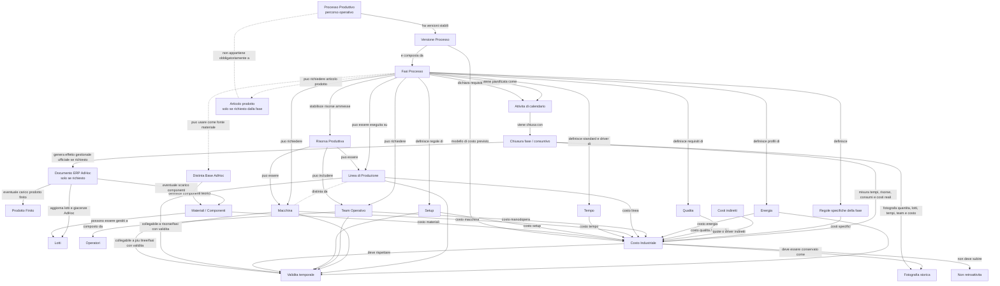

# FactoryFlow - Domain Diagram

## Scopo Del Documento

Questo documento rappresenta il diagramma concettuale del dominio produttivo FactoryFlow.

Il centro del modello non e l'Ordine di Produzione.

Il centro del modello e il Processo Produttivo.

In questa fase FactoryFlow deve chiarire come il processo produttivo determina fasi, risorse, linee, macchine, team, setup, tempi, energia, materiali, costi industriali, chiusura fase e documento ERP.

Regola correttiva: il Processo Produttivo non appartiene obbligatoriamente a un Prodotto Finito o a un Articolo AdHoc. Il Processo Produttivo rappresenta un percorso operativo. L'articolo prodotto viene richiesto nella chiusura della fase solo se quella fase produce un articolo.

L'Ordine di Produzione sara analizzato successivamente, quando verranno affrontati pianificazione, MRP e fattibilita.

## Diagramma Principale

## Lettura Del Diagramma

Il diagramma deve essere letto dall'alto verso il basso.

Il Processo Produttivo definisce un percorso operativo. Non rappresenta una registrazione, non rappresenta un documento, non rappresenta una distinta, non appartiene obbligatoriamente a un articolo e non coincide necessariamente con una linea o una macchina.

Il Processo Produttivo e il modello operativo. La Fase Processo stabilisce cosa deve essere dichiarato. L'Attivita di calendario pianifica o rende prevista una fase. La Chiusura fase e la fotografia con cui FactoryFlow registra cio che e stato fatto. Il Documento ERP e l'effetto ufficiale generato in AdHoc solo quando la fase lo richiede.

Questa distinzione protegge il dominio.

Se si confondono questi concetti, FactoryFlow diventa fragile: una modifica alla macchina rischia di alterare il costo, una modifica al team rischia di cambiare il passato, una distinta viene scambiata per processo, un documento ERP viene scambiato per produzione.

## Relazioni Principali

### Processo Produttivo E Articolo

Il Processo Produttivo non deve essere modellato come proprieta di un Prodotto Finito.

Il processo descrive un percorso operativo. Alcune fasi di quel percorso possono produrre un articolo, consumare componenti e generare documenti ERP. Altre fasi possono essere preparazione, setup, pulizia o controllo qualita e non produrre alcun articolo.

Il prodotto finito come articolo appartiene ad AdHoc. FactoryFlow lo richiede nella chiusura della fase solo quando quella fase produce un articolo o genera un effetto ERP.

### Processo Produttivo e Fasi

Un Processo Produttivo puo avere una sola fase oppure molte fasi.

Nella PMI la fase puo coincidere con una singola attivita su una macchina e generare direttamente il documento ERP.

Nell'industria complessa una fase puo richiedere risorse alternative, setup diversi, controlli qualita, tempi specifici, team differenti e dati di consuntivo diversi.

Il modello deve supportare entrambe le realta senza cambiare struttura concettuale.

Ogni fase deve dichiarare quali dati sono obbligatori per la chiusura: macchina, team, orari, setup, quantita, articolo, lotto, componenti, controllo qualita ed eventuale effetto ERP.

### Distinta Base e Materiali

La Distinta Base appartiene ad AdHoc.

FactoryFlow la legge e la usa come fonte ufficiale per i materiali teorici, i componenti e parte del costo materiali.

La Distinta Base pero non e il centro del costo industriale.

La distinta dice cosa serve. Non dice da sola come si produce, quanto tempo serve, quale macchina lavora, quale team partecipa, quanta energia viene consumata, quale setup viene eseguito o quale qualita viene ottenuta.

### Linea e Macchina

Linea di Produzione e Macchina sono concetti distinti.

Possono coincidere in casi semplici, per esempio una piccola azienda con una sola macchina che rappresenta di fatto l'intero contesto produttivo.

Non devono pero essere fusi nel modello.

Una linea puo contenere piu macchine.

Una macchina puo essere condivisa tra piu linee.

Una macchina puo partecipare a fasi diverse.

Queste relazioni devono avere validita temporale quando incidono su capacita, costi o ricostruzione storica.

### Risorsa Produttiva

La Risorsa Produttiva e il concetto generale che permette di trattare in modo coerente macchina, linea, team, postazione, attrezzatura o altra capacita produttiva.

Non tutte le fabbriche hanno lo stesso livello di dettaglio.

Il modello deve permettere a una piccola azienda di configurare poco e a una grande industria di descrivere molto.

### Team Operativo

Il Team Operativo rappresenta le persone coinvolte nell'attivita produttiva.

Non serve a giudicare le persone.

Serve a comprendere il processo.

Il team contribuisce al costo manodopera, alla ricostruzione storica, alla comprensione delle condizioni operative e alla qualita dell'analisi.

Se il team incide sui costi, deve rispettare validita temporale e fotografia storica.

### Setup

Il Setup non e produzione utile, ma spesso determina una parte decisiva del costo industriale.

Puo dipendere dalla macchina, dall'articolo, dalla linea, dalla fase, dal cambio produzione o da regole specifiche del processo.

Per questo non deve essere trattato come un campo generico della macchina.

Il setup appartiene al modello operativo del processo produttivo.

### Tempo

Il Tempo collega attivita, risorse, costi e capacita.

Senza tempo non esiste produttivita.

Senza tempo non esiste costo orario.

Senza tempo non esiste confronto tra previsto e consuntivo.

FactoryFlow deve distinguere il tempo produttivo dal tempo di setup, attesa, fermo, rilavorazione o presenza.

### Energia

L'Energia e un driver autonomo del costo industriale.

Non deve essere assorbita in modo indistinto nel costo macchina se la fabbrica ha bisogno di comprenderla.

Il consumo a spunto, il consumo a regime, il tempo di utilizzo e il costo dell'energia possono incidere in modo diverso sul risultato industriale.

### Qualita

La Qualita non e soltanto conformita finale.

Influenza costi, scarti, rilavorazioni, fermi, tempi e decisioni.

Il modello deve permettere di collegare la qualita al processo, alla fase, al lotto, al prodotto e alla dichiarazione.

### Costo Industriale

Il Costo Industriale nasce dalla combinazione di:

- materiali;
- setup;
- tempo;
- macchina;
- linea;
- team;
- energia;
- qualita;
- costi indiretti;
- regole specifiche del processo.

Il Processo Produttivo definisce il modello di costo.

L'Attivita Produttiva misura il costo reale.

La Dichiarazione fotografa il costo.

Il Documento ERP rende ufficiale l'effetto gestionale in AdHoc.

## Perche L'Ordine Di Produzione Non E Ancora Nel Centro Del Diagramma

L'Ordine di Produzione rappresentera la domanda organizzata o la richiesta di produrre.

Sara fondamentale quando FactoryFlow affrontera pianificazione, MRP, fattibilita, priorita, capacita disponibile e confronto tra domanda e risorse.

In questa fase pero il problema principale e diverso.

Il problema e capire come una fabbrica produce e come il processo produttivo determina costi, tempi, risorse, materiali e documenti.

Mettere oggi l'Ordine di Produzione al centro del diagramma sarebbe prematuro.

Rischierebbe di far sembrare che tutto nasca dalla richiesta di produrre, mentre il tema architetturale attuale e piu profondo: definire il modello industriale che spiega come si produce.

L'ordine arrivera dopo.

Quando arrivera, dovra collegarsi al Processo Produttivo, non sostituirlo.

## PMI E Grande Industria Usano Lo Stesso Modello

### PMI

Una piccola azienda puo configurare un processo minimo:

- un prodotto finito;
- una distinta AdHoc;
- una fase;
- una linea;
- una macchina coincidente con la linea;
- un team semplice o nessun dettaglio team se non necessario;
- tempi di inizio e fine;
- carico prodotto finito e scarico componenti in AdHoc.

In questo caso il modello resta semplice.

FactoryFlow non deve costringere la PMI a configurare fasi multiple, risorse alternative o costi dettagliati se non le servono.

### Grande Industria

Una grande industria puo espandere lo stesso modello:

- piu fasi;
- piu linee;
- macchine condivise;
- risorse alternative;
- team diversi;
- setup per articolo, linea, macchina o cambio produzione;
- energia per macchina o fase;
- qualita per processo;
- costi indiretti;
- simulazioni;
- confronto previsto/consuntivo.

La struttura concettuale non cambia.

Cambia soltanto il livello di dettaglio.

Questo e il punto chiave: FactoryFlow non deve avere un modello per le PMI e un altro modello per l'industria complessa.

Deve avere un solo dominio, configurabile per profondita.

## Regole Da Non Violare

### Non Fondere Linea E Macchina

Linea e macchina possono coincidere nella pratica, ma devono restare distinte nel dominio.

Fonderle oggi renderebbe difficile gestire domani macchine condivise, linee complesse, capacita alternative, setup e costi macchina.

### Non Appiattire Il Processo Sulla Distinta

La distinta descrive i materiali.

Il processo descrive la trasformazione.

Una distinta non contiene da sola tempi, risorse, energia, setup, qualita, team e costi operativi.

FactoryFlow deve usare la distinta AdHoc, non diventare prigioniero della distinta.

### Non Mettere Il Costo Industriale Solo Sulla Macchina

La macchina contribuisce al costo, ma non lo esaurisce.

Il costo industriale nasce dal processo eseguito in un contesto reale.

Ridurre il costo alla macchina significherebbe ignorare materiali, team, setup, qualita, energia, tempo e regole specifiche.

### Non Usare Flag Attivo/Disattivo Per Dati Che Incidono Sui Costi

Se una informazione incide su costi, tempi, capacita, produttivita o rendicontazione, non deve essere gestita con un semplice flag attivo/disattivo.

Serve validita temporale.

La domanda corretta non e solo: questa informazione e attiva?

La domanda corretta e: in quale periodo questa informazione era valida?

### Non Alterare Il Passato Con Modifiche Future

Una modifica fatta oggi non deve cambiare una produzione confermata ieri.

Le dichiarazioni devono conservare la fotografia storica del contesto che ha generato il risultato:

- linea;
- macchina;
- team;
- operatori;
- ruoli;
- setup;
- tempi;
- energia;
- costi;
- materiali;
- lotti;
- regole valide in quel momento.

Il passato produttivo non deve essere ricalcolato in modo implicito da configurazioni future.

### Non Confondere Dichiarazione E Documento ERP

La dichiarazione appartiene a FactoryFlow.

Il documento ERP appartiene ad AdHoc.

La dichiarazione fotografa l'attivita produttiva.

Il documento ERP rende ufficiale l'effetto gestionale: carico prodotto finito, scarico componenti, lotti e giacenze.

Sono collegati, ma non sono lo stesso concetto.

## Sintesi Architetturale

FactoryFlow deve crescere attorno al Processo Produttivo.

Il Processo Produttivo definisce il modello industriale.

L'Attivita Produttiva porta quel modello nel tempo e nelle risorse reali.

La Dichiarazione conserva la fotografia del fatto produttivo.

Il Documento ERP rende ufficiale l'effetto gestionale in AdHoc.

Questo diagramma non e una rappresentazione tecnica.

E una protezione architetturale.

Serve a impedire che FactoryFlow venga costruito come una somma di maschere, tabelle o urgenze.

FactoryFlow deve restare un modello coerente della fabbrica.

