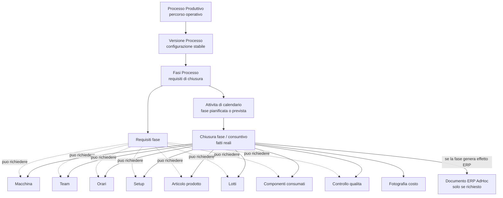

# FactoryFlow - Processo, Fasi E Chiusura Fase

## Scopo Del Documento

Questo documento corregge e stabilizza il modello process-centric di FactoryFlow.

La correzione e importante: il Processo Produttivo non appartiene obbligatoriamente a un Prodotto Finito e non appartiene obbligatoriamente a un Articolo AdHoc.

Il Processo Produttivo rappresenta un percorso operativo della fabbrica.

Il prodotto, la macchina, il team, i tempi, i lotti, i componenti e l'effetto ERP non sono sempre attributi del processo. Diventano dati da dichiarare nella chiusura di una fase solo quando quella fase li richiede.

## Perche Il Processo Non Appartiene All'Articolo

Un articolo AdHoc descrive un bene gestito dall'ERP.

Un Processo Produttivo descrive un modo di lavorare della fabbrica.

Questi due concetti possono incontrarsi, ma non devono essere fusi.

Se FactoryFlow lega obbligatoriamente il processo a un articolo, il modello diventa troppo stretto:

- non riesce a descrivere fasi che non producono articoli;
- non riesce a descrivere preparazioni, setup, controlli e attivita ausiliarie;
- costringe ogni processo a generare un effetto ERP anche quando non serve;
- confonde il percorso operativo con il risultato materiale;
- rende fragile l'evoluzione verso processi multi-fase.

L'articolo prodotto deve essere richiesto solo nella chiusura della fase che produce un articolo.

## Il Processo Come Percorso Operativo

Il Processo Produttivo e il percorso operativo con cui la fabbrica organizza un insieme di attivita.

Puo essere semplice:

- una sola fase;
- una sola linea;
- una sola macchina;
- un solo team;
- una sola chiusura con effetto ERP.

Puo essere complesso:

- piu fasi;
- risorse alternative;
- setup differenti;
- controlli qualita;
- attivita senza ERP;
- fasi che producono semilavorati;
- fasi che generano documenti AdHoc;
- team diversi per fase.

Il modello deve restare lo stesso in entrambi i casi.

## La Nuova Catena Concettuale

Il modello corretto e:

```text
Processo Produttivo
  -> Versione Processo
  -> Fasi Processo
  -> Attivita di calendario
  -> Chiusura fase / consuntivo fase
  -> eventuale Documento ERP AdHoc
```

Il Processo definisce il percorso.

La Versione conserva una configurazione stabile nel tempo.

Le Fasi dichiarano che cosa deve essere fatto e quali dati saranno obbligatori alla chiusura.

L'Attivita di calendario dice quando una fase deve essere eseguita.

La Chiusura fase registra che cosa e realmente accaduto.

Il Documento ERP nasce solo se la fase lo richiede.

## Fasi Processo

Una fase e un segmento operativo del processo.

Esempi di fase:

- preparazione macchina;
- setup;
- tostatura;
- miscelazione;
- confezionamento;
- controllo qualita;
- dichiarazione fine fase;
- pulizia;
- sanificazione;
- cambio formato;
- qualunque altra attivita operativa.

La fase non deve essere pensata come una riga di ciclo ERP.

La fase e un concetto MES: descrive un punto del lavoro reale della fabbrica.

## Requisiti Di Chiusura Della Fase

Ogni fase deve poter dichiarare quali informazioni sono obbligatorie per essere chiusa.

I requisiti principali sono:

- richiede macchina;
- richiede team;
- richiede orari;
- richiede setup;
- richiede quantita prodotta;
- richiede prodotto o articolo;
- richiede lotto prodotto;
- richiede componenti e lotti consumati;
- richiede controllo qualita;
- genera documento ERP;
- genera carico prodotto finito;
- genera scarico componenti.

Questi requisiti non appartengono tutti a tutte le fasi.

Una fase di preparazione macchina puo richiedere macchina, operatori, orari e note, ma non quantita prodotta e non documento ERP.

Una fase di confezionamento puo richiedere articolo prodotto, quantita, lotto, componenti, lotti consumati, macchina, team e documento ERP.

## Chiusura Fase / Consuntivo Fase

La vecchia idea di "dichiarazione fine processo" deve essere trasformata in "chiusura fase" o "consuntivo fase".

La chiusura fase e il momento in cui FactoryFlow registra il fatto reale:

- quando e iniziata la fase;
- quando e finita;
- quale macchina e stata usata;
- quale team ha partecipato;
- quali quantita sono state ottenute;
- quali lotti sono stati prodotti;
- quali componenti sono stati consumati;
- quale esito qualita e stato rilevato;
- quali note operative sono state aggiunte;
- quale costo e stato fotografato;
- se e stato generato un documento ERP.

La chiusura fase e quindi il punto corretto in cui consuntivare i dati.

Non tutto deve stare sul processo.

Non tutto deve stare sull'attivita.

Non tutto deve generare AdHoc.

## Fasi Con E Senza Effetto ERP

Una fase puo non generare alcun documento ERP.

Esempio: preparazione macchina.

La fabbrica vuole sapere chi ha preparato la macchina, quanto tempo e servito, quali note sono emerse e se ci sono anomalie. Ma non deve caricare o scaricare magazzino.

Una fase puo invece generare documento ERP.

Esempio: confezionamento.

La fase produce un articolo, consuma componenti, movimenta lotti e deve generare in AdHoc il carico del prodotto finito e lo scarico dei componenti.

La stored AdHoc ufficiale rimane il motore per l'effetto gestionale quando serve. FactoryFlow non deve duplicare questa logica.

## Esempi

| Fase | Dati richiesti alla chiusura | Effetto ERP |
| --- | --- | --- |
| Preparazione macchina | Macchina, operatori, orari, note | No |
| Setup | Macchina, team, tipo setup, orari, note | No, salvo casi specifici |
| Tostatura | Macchina, team, orari, quantita, lotto, eventuali componenti | Possibile |
| Miscelazione | Macchina, team, orari, componenti, lotti, quantita ottenuta | Possibile |
| Confezionamento | Articolo prodotto, quantita, lotto PF, componenti, lotti consumati, macchina, team | Si, se la fase produce effetto magazzino |
| Controllo qualita | Esito, note, non conformita, operatore, orari | Non necessariamente |

## Diagramma Concettuale



## Compatibilita Con Il Vecchio MVP

Il vecchio MVP resta compatibile.

Se l'azienda usa un processo minimo con una sola fase produttiva che genera ERP, il flusso operativo puo apparire quasi identico all'attuale dichiarazione produzione.

La differenza e concettuale:

prima sembrava una "dichiarazione produzione";

ora e una "chiusura fase produttiva con effetto ERP".

Questa distinzione permette di crescere senza rompere il comportamento gia funzionante.

## Regole Da Non Violare

- Non rendere obbligatorio il legame Processo Produttivo -> Articolo AdHoc.
- Non mettere prodotto finito, lotto, componenti, macchina e team direttamente sul processo se appartengono al consuntivo della fase.
- Non forzare tutte le fasi a generare ERP.
- Non trasformare la distinta AdHoc nel centro del processo.
- Non usare la dichiarazione fine processo come oggetto monolitico.
- Non modificare la stored AdHoc per salvare dati MES che appartengono a DB_FARMFLOW.
- Non alterare il passato con modifiche future.
- Non rompere gli endpoint esistenti senza compatibilita.

## Regola Finale

FactoryFlow non registra semplicemente una produzione.

FactoryFlow consuntiva fasi operative.

Quando una fase produce effetti gestionali, FactoryFlow genera anche il documento ERP AdHoc.
